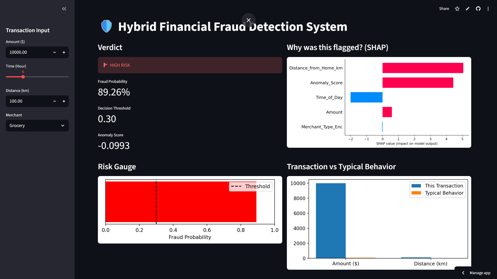

# Hybrid Financial Fraud Detection System

## Dashboard Preview


## Try it out!
🚀 **Interactive Web App:**  
https://YOUR-APP-NAME.streamlit.app

A hybrid machine learning system for fraud risk scoring that combines:
- Unsupervised anomaly detection (Isolation Forest)
- Supervised classification (XGBoost)
- Threshold-tuned decision logic
- SHAP-based explainability
- Interactive Streamlit dashboard

## Features
- Handles severe class imbalance (1% fraud)
- Transaction-level risk scoring
- Explainable AI for audit-ready decisions
- Analyst-style monitoring interface

## Run locally
```bash
pip install -r requirements.txt
python model/train.py
streamlit run app/app.py
